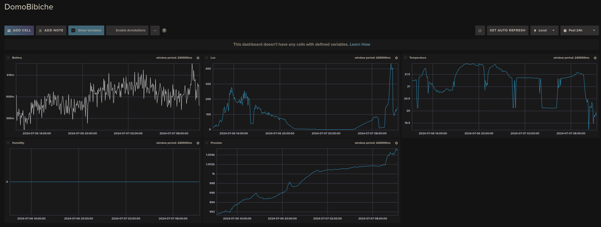
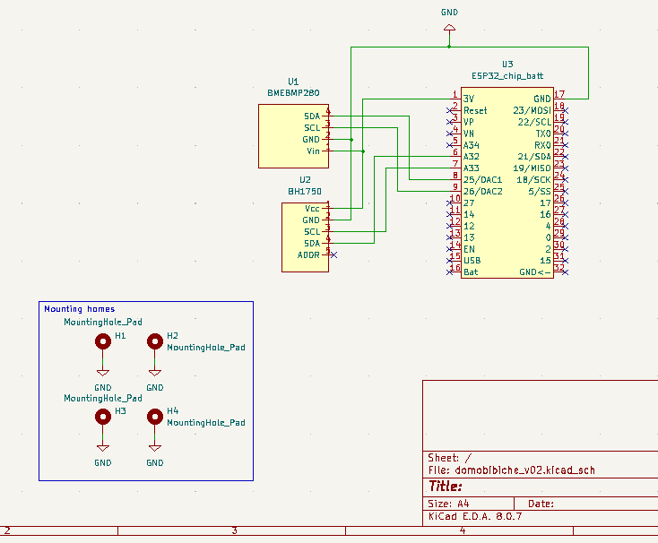
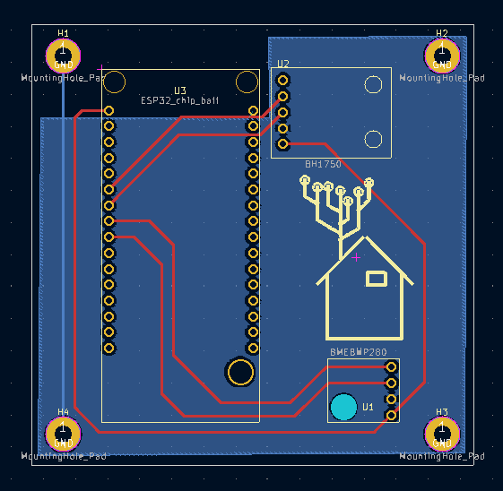

# Domotik, Micropython and InfluxDB

## Concept
A serie of multiple microcontrollers (Clients) are communicating through ESPNow technology to a main microcontroller (Broker) developed with Micropython. The broker is then agglomerating all informations, parse the data, and transfer them to a Raspberry Pi (RPI) via a simple serial communication. This RPI is submitting informations to a database (InfluxDB) and display latest received message on a display (e-ink).
The philosophy used here is similar to this great project here [https://github.com/timmbogner/Farm-Data-Relay-System/].

## Visuals
The main interface looks like:
<div>
  
</div>

and the devices:
<div>
  
  
</div>


## Hardware & Integration

### Wiring

```
ESP32        BME280    BH1750   Battery
----------   -------   ------   -------  -----
       3V3 - Vin     - Vcc       -Vcc     - Vcc
       GND - GND     - GND      - GND     - GND
       G26 - SCL     
       G25 - SDA     
       G33 -         - SCL
       G32 -         - SDA
```


### Elec design
The schematic and pcb design has been designed via KiCad:
<div>
  
  
</div>


## Price
```
         Object           Price (€)
-----------------------   -----
                  ESP32 - 5
                 BME280 - 5 
                 CCS811 - 5
            Rpi zero 2w - 25
        WaveShare e-ink - 15
```


## Components selection
The comparison between boards made by Andreas Spiess can be found here [https://www.youtube.com/watch?v=ajt7vtgKNNM] and summarized by him here [https://docs.google.com/spreadsheets/d/1Mu-bNwpnkiNUiM7f2dx8-gPnIAFMibsC2hMlWhIHbPQ/edit#gid=0].

### Issues observed
Using micropython and the associated espnow package seems to draw a lot of current (oscilloscope measurement in progress). With an esp32 and a TP4056 connected to the board, even with capacitors to reduce the peak, the esp32 board never achieved the connection and lead to an infinite loop of reboot sequence.
With direct integration of the battery system at the board level, this behaviour is no longer observed.

Finally, an esp32 with 'onboard' integration of the battery has been selected to avoid integration of a charger (TP4056 for example).

### Power consumption
To reduce the power consumption of this project, an e-ink display has been selected. The cpu frequency of the microcontroller has been reduced via the micropython command:

```
machine.freq(80000000)
freq_machine = machine.freq()
```


## ESP-now
The distant communication between microcontrollers is here based on the 'ESP-Now' technology [https://github.com/espressif/esp-now/blob/master/User_Guide.md]. The performance of this protocol is really promising [https://ieeexplore.ieee.org/document/9573246], with around 180m of maximum range. However, the current consumption is higher than the bluetooth.

### Direct communication through the computer
During the early phase of this project, the direct communication for the raspberry pi <-> esp32 has been investigated.
However, due to the complexity to decrype the interlayer communication of this esp-now protocol, this strategy has ben avoided (for now ?).
For a better overview of the problem, the projects [https://github.com/thomasfla/Linux-ESPNOW], [https://esp32-open-mac.be/], [https://iot.stackexchange.com/questions/2345/802-11-action-frames-send-and-receive-in-software] clarify the actual status.


## Installation

### Clients & Broker

#### Flash them
Prepare the esp32 boards with the latest version of Micropython.
Connect the usb to the USB port and execute the following commands:

```
esptool.py --chip esp32 --port /dev/ttyUSB0 erase_flash
```

Note the mac adress:

```
MAC: 11:22:33:44:55:66
```

and then upload the firmware:

```
esptool.py --chip esp32 --port /dev/ttyUSB0 --baud 460800 write_flash -z 0x1000 ESP32_GENERIC-20240602-v1.23.0.bin 
```


#### Update the MAC address
For communication between the clients and the broker, you will need to update the mac address in the micropython scripts. For the client and the broker, that will be respectively, the files in Src/Client/main.py and Src/Broker/main.py.
Update the lines:

```
receiver_mac = 'a1:b1:c1:d1:e1:f1'
```

and 

```
sender_mac = 'a2:b2:c2:d2:e2:f2'
```

If you have two usb ports on the board, don't forget to switch to the COM port.
Then, upload the micropython files on the board (via Thonny for example) to the corresponding microcontroller. 

Finally, to associate this address of the client with a 'Generic' name of the localisation (for example the living room, ...), you can update the parser register in Src/Parser/intellectron_main.py:

```
MAC address to name mapping dictionary
mac_to_name = {
    'a2:b2:c2:d2:e2:f2': 'Living Room',
    'a3:b3:c3:d3:e3:f3': 'Device 2',
    # Add more mappings as needed
}
```

### Parser
The parser is a simple rpi zero 2w with a crontab task executing a python script. The database is populated via the InfluxDB strategy and displayed on the e-ink screen.

#### Setup the RPI
Test if the device is on the wifi and establish first connection

```
ping rpi.local
ssh -X me@rpi.local
```

#### InfluxDB
The protocol to install influxdb is inspired from [https://fleetstack.io/blog/install-influxdb-raspberry-pi]. To achieve this, first, install the influxdata package:

```
curl -LO https://download.influxdata.com/influxdb/releases/influxdb2_2.7.6-1_arm64.deb
sudo dpkg -i influxdb2_2.7.6-1_arm64.deb
```

and the required package for the parser
```
pip install influxdb-client --break-system-packages
python -m pip install pyserial --break-system-packages
```

Start the InfluxDB service:

```
sudo service influxdb start
sudo service influxdb status
● influxdb.service - InfluxDB is an open-source, distributed, time series database
     Loaded: loaded (/lib/systemd/system/influxdb.service; enabled; preset: enabled)
     Active: active (running) since Sun 2024-05-26 16:00:35 CEST; 23s ago
```

Use ifconfig to get your ip's adress:

```
wlan0: flags=4163<UP,BROADCAST,RUNNING,MULTICAST>  mtu 1500
        inet <Your-Raspberry-Pi-IP-Address>
```

Open a web browser and navigate to <Your-Raspberry-Pi-IP-Address:8086>.

Record your token:

```
This_Is_A_Token
```

#### Set the e-ink display
To setup the e-ink, the installation described by [https://www.waveshare.com/wiki/2.13inch_e-Paper_HAT_(B)_Manual#Working_With_Raspberry_Pi] has been used.
First, enable the SPI interface:

```
sudo raspi-config
Choose Interfacing Options -> SPI -> Yes Enable SPI interface
sudo apt-get update
sudo apt-get install python3-pip
sudo apt-get install python3-pil
sudo apt-get install python3-numpy
sudo pip3 install RPi.GPIO --break-system-packages
sudo pip3 install spidev --break-system-packages
```

And then install the python package of the waveshare display with:

```
cd Downloads
git clone https://github.com/waveshare/e-Paper.git
cd e-Paper/RaspberryPi_JetsonNano/python
pip install . --break-system-packages

```

A nice tutorial to install it can be found here [https://dev.to/ranewallin/getting-started-with-the-waveshare-2-7-epaper-hat-on-raspberry-pi-41m8] an for more control over the e-ink display, this project seems to be interesting [https://github.com/txoof/epd_display#readme].


#### Crontab
To execute the python script on RPI at every startup, update the crontab as:

```
crontab -e
@reboot python /home/bibicheski/BibicheCorp/intellectron_main.py
```


### Test and Deploy
## First integration


## Roadmap
This is the expected roadmap for this project:


### Proof of concept: version 0.0.1
- [x] Establish ESPNow communication from clients to Broker.
- [x] Track errors during script execution using the logging package


### Breadboard: version 0.0.2
- [x] Integrate sensors
- [x] Fix issue due to too low current for enabling the ESP-Now communication
- [x] Readme: add 'as it is' words


### Be professional
- [ ] Add a casing to the clients: 3D Print a casing
- [ ] Determine the lifetime of the client on battery


## Project status
This project is still in progress and should be completed soon.


## Support
No technical support can be provided.


## Authors and acknowledgment
The authors would like to express their gratitude to all the people who took part in the project.


## License
This project has been developed under MIT license.


## Contributing
Not yet filled.


## Credits
This script was mainly developed by John Bigeon. If you have any questions or feedback, please don't hesitate to contact me.
